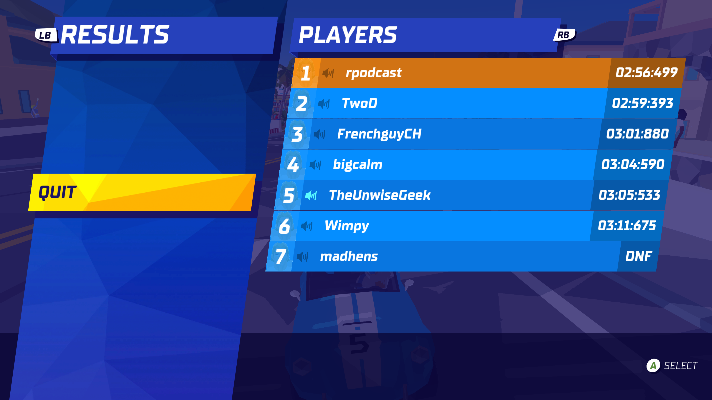

```{r, include = FALSE}
knitr::opts_chunk$set(
  collapse = TRUE,
  comment = "#>"
)
```

```{r setup}
library(dplyr)
library(purrr)
library(magick)
library(tesseract)
library(ggplot2)
```

## Extracting data from race standings

In the awesome Hot Shots racing game, there is currently no API available to obtain the racing statistics and results during a game (or after a game for that matter). After each race, the results are shown as in the example here:



While I could certainly get a spreadsheet created and update the data manually, what if there was a mostly automated way of grabbing this information which already is fairly tabular to minimize manual effort?

That's when I remembered [Thomas Mock](https://themockup.blog/about.html) authored a set of tutorials on his blog for extracting data from various sources, including from images shared in Twitter or other means on [this post](https://themockup.blog/posts/2021-01-18-reading-tables-from-images-with-magick/). The key packages used in the process are [magick](https://docs.ropensci.org/magick/index.html) , a wrapper to the very powerful ImageMagick image processing software, and [tesseract](https://docs.ropensci.org/tesseract/) which is a wrapper to the optical character recognition (OCR) engine of the same name created by Google. It seems like we should be able to adapt most of the principles into a workflow for this app. Mainly, to create an R function that obtains the results of this table when supplied with an image file. The remainder of this document details my development journey to create this important function!

## Importing image

Our first step is to simply import the image into memory and ensure it displays just like the screen grab above.

```{r import-image}

import_file <- "../inst/app/screenshots/609920_20210207165937_1.png"
raw_img <- image_read(import_file)
image_ggplot(raw_img)

```

## First (easy) approach

My first approach is to simply crop out the unnecessary parts of the image so only the table appears. For that, we can use the `image_crop()` function, and try using the `geometry_area` function to provide the dimensions.

```{r}

ga <- geometry_area(width = 2500, height = 1400, x_off = 1400, y_off  = 300)
raw_img %>%
  image_crop(ga) %>%
  image_ggplot()
```

That looks pretty good, and perhaps ocr will work out of the box?

```{r}
raw_img %>%
  image_crop(ga) %>%
  image_ocr()
```

While some of the names came out correctly, only some of the times were extracted and not for everyone. In his post, Thomas recommends converting the image to a grayscale to minimize noise based on colors. Also, in my case, the text is a white font, which means we will need to somehow convert it to a dark color.

```{r}
raw_img %>%
  image_crop(ga) %>%
  image_quantize(colorspace = "gray") %>%
  image_transparent(color = "gray", fuzz = 10) %>%
  image_ggplot()
```

Well that didn't work as expected! It seems like the cells each having slightly different background colors is throwing things off. Plus the table being slanted isn't helping either. Perhaps I need to think of a different approach that can isolate the contents better...

## Second Approach (individual cells)

Instead of trying to obtain all of the cells in one text extraction call, we could try simply obtaining each data "cell" individually and then pasting everything together. Since the table will always be sorted by the race times in ascending order, we don't need the index of the place. We just need the name of the racer and the times. Let's try extracting the first place winner's name (which happens to be me!)

```{r}
#"700x120+1800+320"
ga <- geometry_area(width = 700, height = 120, x_off = 1800, y_off  = 320)
raw_img %>%
  image_crop(ga) %>%
  image_ggplot()
```

Excellent, now we only have the text and a solid background color. Let's try out the grayscale operation again:

```{r}
ga <- geometry_area(width = 700, height = 120, x_off = 1800, y_off  = 320)
raw_img %>%
  image_crop(ga) %>%
  image_quantize(colorspace = "gray") %>%
  image_transparent(color = "gray", fuzz = 10) %>%
  image_ggplot()
```

If the font color had been darker, then we would probably be ready for extraction. But we should try making this as easy as possible for OCR. One approach is to simply make the background black and then invert or flip the colors so that the background becomes white and the font becomes black:

```{r}
ga <- geometry_area(width = 700, height = 120, x_off = 1800, y_off  = 320)
raw_img %>%
  image_crop(ga) %>%
  image_quantize(colorspace = "gray") %>%
  image_transparent(color = "gray", fuzz = 10) %>%
  image_background("black") %>%
  image_negate() %>%
  image_ggplot()
```

Now that should have an easier time for OCR! Let's find out:

```{r}
ga <- geometry_area(width = 700, height = 120, x_off = 1800, y_off  = 320)
raw_img %>%
  image_crop(ga) %>%
  image_quantize(colorspace = "gray") %>%
  image_transparent(color = "gray", fuzz = 10) %>%
  image_background("black") %>%
  image_negate() %>%
  image_ocr()
```

Great! Other than the newline character at the end, I am very satisfied with that result. We can always remove that with the `stringr` package at the end.

Let's try that same process with the associated race time. Other than changing the geometry parameters, the rest of the code should largely be the same.

```{r}
#370x120+3300+320
ga <- geometry_area(width = 370, height = 120, x_off = 3300, y_off  = 320)
raw_img %>%
  image_crop(ga) %>%
  image_quantize(colorspace = "gray") %>%
  image_transparent(color = "gray", fuzz = 10) %>%
  image_background("black") %>%
  image_negate() %>%
  image_ggplot()
```

```{r}
ga <- geometry_area(width = 370, height = 120, x_off = 3300, y_off  = 320)
raw_img %>%
  image_crop(ga) %>%
  image_quantize(colorspace = "gray") %>%
  image_transparent(color = "gray", fuzz = 10) %>%
  image_background("black") %>%
  image_negate() %>%
  image_ocr()
```

Success! Even with the background not being completely white, the numbers were still extracted correctly.

## Iterative Processing

Since we want to simply run this same type of processing for each of the name and time cells in the screenshot, it makes sense to define a simple data frame with each row corresponding to the particular dimensions needed for a given entry in the table. This is a perfect time to set up a tibble in a row-wise fashion.

```{r}
dim_df <- tibble::tribble(
    ~position, ~crop_name, ~crop_time, ~fuzz_name, ~fuzz_time,
    1, "700x120+1800+320", "370x120+3300+320", 30, 10,
    2, "700x120+1800+505", "370x120+3280+500", 30, 10, 
    3, "700x120+1780+670", "370x120+3250+660", 30, 10, 
    4, "700x120+1750+830", "370x120+3230+830", 10, 10, 
    5, "700x120+1730+1000", "370x120+3210+990", 10, 10, 
    6, "700x120+1700+1160", "370x120+3160+1160", 10, 10, 
    7, "700x120+1670+1320", "370x120+3140+1320", 10, 10,
    8, "700x120+1640+1480", "370x120+3130+1480", 10, 10
)

dim_df

```

Now we can simply use a little `dplyr` and `purrr` magic to iterate through each of these cells and apply a simple function that encapsulates the logic seen in our dev code earlier.

```{r}
# set ocr options
combo <- tesseract::tesseract(
    options = list(
    tessedit_char_whitelist = paste0(
        c(letters, LETTERS, " ", ":.0123456789 (-)"), collapse = "")
    )
)
    
get_data <- function(crop_dim, fuzz, raw_img, combo, view_cell = FALSE) {
    img_p <- raw_img %>%
        image_crop(crop_dim) %>%
        image_quantize(colorspace = "gray") %>%
        image_transparent(color = "gray", fuzz = fuzz) %>%
        image_background("black") %>%
        image_negate()

    val <- ocr(img_p, engine = combo)

    if (view_cell) print(image_ggplot(img_p))

    return(val)
}

# begin extraction
df2 <- dim_df %>%
  slice(1:7) %>%
  mutate(player_name = purrr::map2_chr(crop_name, fuzz_name, ~get_data(crop_dim = .x, fuzz = .y, raw_img, combo))) %>%
  mutate(player_time = purrr::map2_chr(crop_time, fuzz_time, ~get_data(crop_dim = .x, fuzz = .y, raw_img, combo))) %>%
  select(position, player_name, player_time) %>%
  mutate(position = as.numeric(position)) %>%
  mutate_at(c("player_name", "player_time"), ~stringr::str_replace_all(., "\\n", ""))

df2
```
